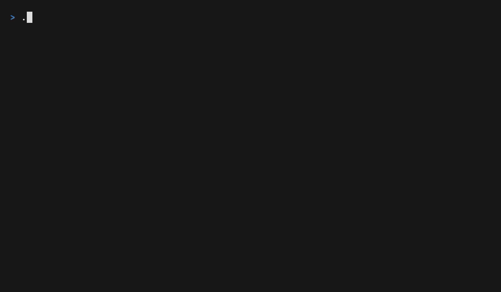

<picture>
  <source media="(prefers-color-scheme: dark)" srcset="docs/branding/maze-wordmark-dark.svg">
  
</picture>

Interactive maze pathfinding visualizer in modern C++ with real-time algorithm
exploration, weighted terrain, and an FTXUI-driven terminal UI.


## Demo


## Highlights
- 5 algorithms: BFS, DFS, Dijkstra, A*, Greedy Best-First
- 3 maze generators: Recursive Backtracker, Prim, Kruskal
- Interactive UI for choosing algorithms, generators, terrain, and endpoints
- Real-time exploration view with a pulse-wave solution reveal
- Lightweight Catch2 test suite and Doxygen-ready APIs

## Quick Start
```bash
cmake --preset release
cmake --build --preset release
./build/maze
```

## Controls
| Key | Action |
| --- | --- |
| Arrow keys | Move cursor / navigate menus |
| Enter | Select menu option |
| S | Set start |
| D | Set destination |
| Space | Solve |
| R | Regenerate |
| Tab | Toggle focus between grid and menu |
| Q | Quit |

## Algorithms
| Algorithm | Weighted | Optimal | Notes |
| --- | --- | --- | --- |
| BFS | No | Yes | Uniform cost, good baseline |
| DFS | No | No | Depth-first exploration |
| Dijkstra | Yes | Yes | Weighted shortest path |
| A* | Yes | Yes | Dijkstra + heuristic |
| Greedy Best-First | No | No | Heuristic-driven, fast but not optimal |

## Generators
- Recursive Backtracker: longer corridors, classic feel
- Prim: dense branching, many short dead ends
- Kruskal: balanced structure with varied junctions

## Build & Test
```bash
cmake --preset debug
cmake --build --preset debug
ctest --preset default
```

## API Docs
```bash
cmake --build --preset debug --target docs
```

## License
MIT
